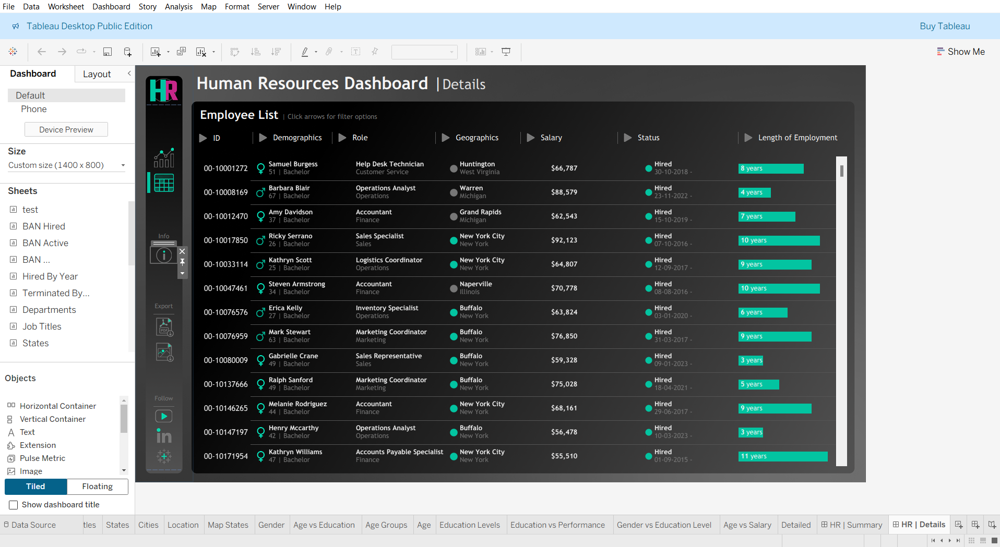

# HR Analytics Dashboard – Tableau

## 📌 Project Overview
This project is a **Human Resources Analytics Dashboard** created using **Tableau Desktop**.  
It helps analyze HR metrics such as **employee attrition, demographics, department performance, and salary trends**.  

---

## 🛠 Tools Used
- Tableau Desktop  
- Excel / CSV Dataset   

---

## 📁 Files in This Repository
- `HR_Analytics_Dashboard.twbx` – Tableau packaged workbook  
- `dataset.csv` – HR dataset used in analysis  
- `hr_summary.png` – Screenshot of HR Summary dashboard  
- `hr_detail.png` – Screenshot of HR Detail dashboard   

---

## 📊 Dashboards

### 🔹 HR Summary
  
**Insights:**  
- Total Employees  
- Active vs Terminated Employees  
- Attrition Rate  
- Gender Distribution  
- Department-wise Employee Count  

### 🔹 HR Detail
  
**Insights:**  
- Employee details by department  
- Job role and education analysis  
- Salary and tenure analysis  
- Detailed employee-level view  

---

## 📌 How to View
GitHub cannot preview Tableau files.  

To view the interactive dashboard:  
1. Download `HR_Analytics_Dashboard.twbx`  
2. Open it using **Tableau Desktop**  

---

## 🎯 Key Learnings
- Built end-to-end HR dashboard in Tableau  
- Created KPIs and calculated fields  
- Designed interactive dashboards with filters  
- Gained hands-on experience in HR data analysis  

---
